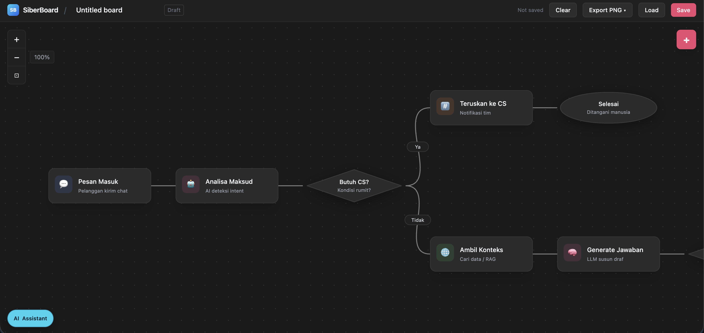

<div align="center">

# 🟦 SiberBoard

**Visual flow & flowchart builder ringan dengan AI assistant opsional.**

Rancang alur kerja, flowchart, dan diagram proses secara visual di browser: drag, sambung, simpan, ekspor, dan bantu generate lewat AI.

_Sebuah produk dari **Datasiber Lab** · `board.datasiber.com`_



</div>

---

## Apa itu SiberBoard?

SiberBoard adalah kanvas visual untuk membangun **workflow** dan **flowchart**. Anda bisa menambah node, menghubungkan konektor, memberi label, menyimpan board, ekspor PNG, dan memakai **AI assistant** untuk membuat atau merapikan diagram.

Cocok untuk:

- Membuat **flowchart** dan diagram proses.
- Merancang alur kerja / automasi secara visual.
- Menyusun diagram cepat untuk dokumentasi atau presentasi.

## Fitur

- 🧩 **Banyak jenis node** — Flowchart, Blank, Triggers, Flow, Data & Code, Integrations, AI.
- 🔷 **Node flowchart dengan bentuk asli** — Start/End, Process, Decision, Input/Output, Document, Database, dan lainnya.
- 🔌 **4 titik konektor per node** — kiri, kanan, atas, bawah.
- 🏷️ **Label konektor** untuk cabang seperti `Ya` / `Tidak`.
- ✏️ **Edit node** — ubah label, deskripsi, dan icon.
- 🔍 **Pan & zoom** kanvas.
- 📐 **Resize node** dan edge akan ikut menyesuaikan.
- 🖼️ **Export PNG** — background gelap atau transparan.
- 💾 **Save & Load** board sebagai file JSON.
- 🧹 **Clear** untuk mengosongkan board.
- 🤖 **AI Assistant** — generate node, koneksi, edit node/edge, hapus elemen, dan auto-layout.
- 🔐 **Login untuk AI Assistant** — akses AI dibatasi dengan username/password dari `.env`.

## Menjalankan SiberBoard

SiberBoard sekarang memakai server Node lokal untuk:

- menyajikan file statis,
- memanggil provider AI,
- dan menangani login AI assistant.

### Setup

```bash
npm install
cp .env.example .env
```

Isi `.env` sesuai kebutuhan:

```env
DEEPSEEK_API_KEY=...
OPENAI_API_KEY=...
GROK_API_KEY=...

OPENAI_MODEL=gpt-5.4-nano
AI_LOGIN_USERNAME=admin
AI_LOGIN_PASSWORD=change_me
```

### Development

```bash
npm run dev
```

Lalu buka <http://127.0.0.1:8000>.

> Setelah mengubah `.env`, restart `npm run dev` karena environment dibaca saat server startup.

### Build production

```bash
npm run build
```

Folder hasil build ada di `dist/`.

## Cara Pakai

### Menambah node

Klik tombol **➕** di kanan atas, cari node, lalu klik item yang diinginkan.

### Memindah & resize

Drag badan node untuk memindah. Hover node lalu tarik handle pojok kanan bawah untuk mengubah ukuran.

### Menghubungkan node

Hover node sampai titik konektor muncul, lalu tarik dari salah satu dari **4 port**: kiri, kanan, atas, atau bawah.

### Mengedit node

Klik tombol **✎** pada toolbar hover node, atau double-click node.

### Menghapus

- Node: tombol **🗑**
- Konektor: klik garis lalu pilih **Hapus**
- Semua: tombol **Clear**

### AI Assistant

Klik **AI Assistant** di kiri bawah.

- Jika belum login, panel login akan muncul.
- Setelah login, Anda bisa meminta AI untuk:
  - membuat flowchart,
  - menghubungkan node,
  - mengubah label/deskripsi/icon,
  - menghapus node atau edge,
  - merapikan layout.

Contoh prompt:

```text
Buat flowchart pendaftaran siswa dari mulai, isi formulir, upload dokumen, validasi data, lalu bercabang ya/tidak.
```

```text
Ganti label node "Analisa Maksud" menjadi "Analisis Intent" lalu rapikan layout.
```

### Simpan & buka kembali

- **Save** — simpan board ke file JSON
- **Load** — buka kembali file JSON yang pernah disimpan

## Teknologi

- HTML statis + CSS inline di [index.html](index.html)
- JavaScript ES modules di [src](src)
- SVG untuk edge dan shape flowchart
- Node.js server lokal di [server.mjs](server.mjs)
- Tailwind CSS + esbuild saat build

## Catatan

- AI assistant memerlukan login dan API key provider.
- Session login AI disimpan di memory server; restart server akan logout semua session.
- Auto-layout saat ini masih dasar; hasilnya sudah lebih rapi, tapi belum setara engine graph layout penuh.

Ingin memahami implementasinya lebih detail? Lihat **[DEVELOPMENT.md](DEVELOPMENT.md)**.

---

<div align="center">

**SiberBoard** · Datasiber Lab · [datasiber.com](https://datasiber.com)

</div>
